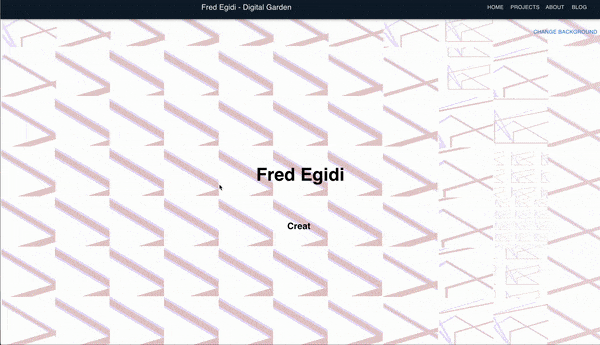

# Digital Garden

Personal Portfolio WebPage / Curriculum

Made using React and NodeJs

## Table of Contents

- [Demo](#demo)
- [Features](#features)
- [Installation](#installation)
- [Usage](#usage)
- [Technologies Used](#technologies-used)
- [Contributing](#contributing)
- [License](#license)

## Demo

You can see a live demo of this application [here](https://digital-garden-69r6.onrender.com/).


Provide an introduction to your project. Explain what it does, its purpose, and any relevant background information. You can also include a screenshot or a GIF to showcase the project.

## Features

- Dinamic changing background according to the mouse position

- Generates dynamic changing backgrounds with the option to generate new patterns.
  

## Installation

Step-by-step instructions on how to install your project.

Clone the repository.
   
   ```
   git clone https://github.com/your-username/your-project.git
   cd your-project
   npm install
  ```

Start the application.

```
npm start
```

Open your web browser and visit http://localhost:3000 to access the application.

## Technologies Used
React
Node.js
Express

Contributing
Explain how others can contribute to your project or get involved. Include guidelines for reporting issues, making pull requests, or any specific rules for contributors.

License
This project is licensed under the MIT License. You can freely use and modify this project for your purposes. See the LICENSE file for details.


